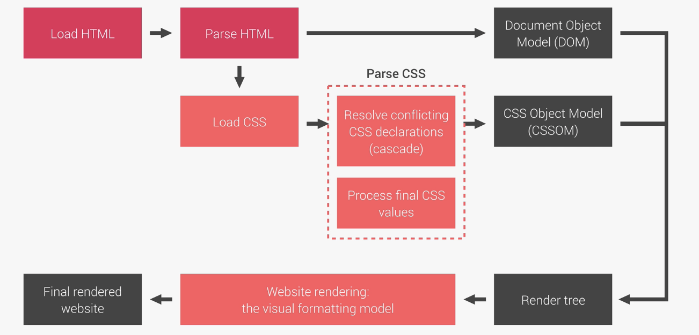

# NATOURS PROJECT

# 1. Setup and First Step

## 1) Building the Header

<br><br>

## 2) Creating Cool CSS Animations

<br><br>

## 3) Building a Complex Animated Button

```css
animation-name: moveInLeft;
animation-duration: 1s;
animation-timing-function: ease-out;
animation-delay: 3s;
animation-iteration-count: 3;

/* 위와 같음*/
animation: moveInLeft 1s ease-out 3s 3;
```

<br><br>

# 2. How Css Works: A Look behind the Scenes

## 1) 훌륭한 CSS와 HTML을 작성하기 위한 방법

### (1) Responsive design

- Fluid layouts
- Media queries
- Responsive images
- Correct units
- Desktop-first vs mobile-first

<br>

### (2) Maintainable and scalable code

- Clean
- Easy-to-understand
- Growth
- Reusable
- How to organize files
- How to name classes
- How to structure HTML

<br>

### (3) Web performance

- Less HTTP requests
- Less code
- Compress code
- Use a CSS preprocessor
- Less images
- Compress images

<br><br>

## 2) An Overview

### (1) What Happens to CSS when we load up a Webpage?



<br>

### (2) How CSS is parsed. Part 1: The Cascade and Specificity

- The cascade
  - Importance(Weight) > Specificity > Source Order 순서로 우선순위

<br><br>

# 3. Introduction to Sass and NPM

## 1) What is Sass ?

- Sass is a CSS preprocessor, an extension of CSS that adds power and elegance to the basic language.

<br>

## 2) Main Sass Features

- **Variables**: for reusable values such as colors, font-sizes, spacing, etc
- **Nesting**: to nest selectors inside of one another, allowing us to write less code
- **Operators**: for mathmetical operations right inside of CSS
- **Partials and imports**: to write CSS in different files and importing them all into one single file
- **Mixins**: to write reusable pieces of CSS code
- **Functions**: similar to mixins, with the difference that they produce a value that can than be used
- **Extends**: to make different seletors inherit declarations that are common to all of them
- **Control directives**: for writing complex code using conditions and loops

<br>

## 3) First Steps with Sass: Variables and Nesting

### (1) clearfix

- child element가 float 속성을 부여받아 떠버리면 parent element 블록 너비와 높이가 0이 되면서 child element를 담을 수 없게 됨.

```html
<nav>
  <ul class="navigation">
    <li><a href="#">About us</a></li>
    <li><a href="#">Pricing</a></li>
    <li><a href="#">Contact</a></li>
  </ul>
  <div class="buttons">
    <a class="btn-main" href="#">Sign up</a>
    <a class="btn-hot" href="#">Get a quote</a>
  </div>
</nav>
```

<br>

```scss
* {
  margin: 0;
  padding: 0;
}

$color-primary: #f9ed69; // yellow color
$color-secondary: #f08a5d; // orange
$color-tertiary: #b83b5e; // pink
$color-text-dark: #333;

nav {
  margin: 30px;
  background-color: $color-primary;
}

.navigation {
  list-style: none;
  float: left;
  li {
    display: inline-block;
    margin-left: 30px;
    &:first-child {
      margin: 0;
    }
    a:link {
      text-decoration: none;
      text-transform: uppercase;
      color: $color-text-dark;
    }
  }
}

.buttons {
  float: right;
}
```

<br>

- 즉 위 코드는 buttons 클래스에 float:right; 을 지정함으로써 부모 태그 nav의 background-color 속성이 더이상 적용되지 않음.
- 이를 해결하기 위한 hack으로 clearfix가 있다. clearfix를 적용한 코드는 아래와 같다.

```html
<nav>
  <ul class="navigation">
    <li><a href="#">About us</a></li>
    <li><a href="#">Pricing</a></li>
    <li><a href="#">Contact</a></li>
  </ul>
  <div class="buttons">
    <a class="btn-main" href="#">Sign up</a>
    <a class="btn-hot" href="#">Get a quote</a>
  </div>
</nav>
```

<br>

```scss
* {
  margin: 0;
  padding: 0;
}

$color-primary: #f9ed69; // yellow color
$color-secondary: #f08a5d; // orange
$color-tertiary: #b83b5e; // pink
$color-text-dark: #333;

nav {
  margin: 30px;
  background-color: $color-primary;
  // clearfix
  &::after {
    content: "";
    clear: both;
    display: table;
  }
}

.navigation {
  list-style: none;
  float: left;
  li {
    display: inline-block;
    margin-left: 30px;
    &:first-child {
      margin: 0;
    }
    a:link {
      text-decoration: none;
      text-transform: uppercase;
      color: $color-text-dark;
    }
  }
}

.buttons {
  float: right;
}
```

<br><br>

## 4) First Steps with Sass: Mixins, Extends and Functions

### (1) mixins

- mixin is just a reusable piece of code

```scss
@mixin clearfix {
  &::after {
    content: "";
    clear: both;
    display: table;
  }
}

nav {
  margin: 30px;
  background-color: $color-primary;
  @include clearfix;
}
```

<br>

```scss
@mixin style-link-text($color) {
  text-decoration: none;
  text-transform: uppercase;
  color: $color;
}

.navigation {
  list-style: none;
  float: left;
  li {
    display: inline-block;
    margin-left: 30px;
    &:first-child {
      margin: 0;
    }
    a:link {
      @include style-link-text($color-text-dark);
    }
  }
}

.btn-main:link,
.btn-hot:link {
  padding: 10px;
  display: inline-block;
  text-align: center;
  border-radius: 100px;
  width: $width-button;
  @include style-link-text($color-text-light);
}
```

- https://codepen.io/yoojh9/pen/ExGMOqb

<br>

### (2) Functions

- darken($color-secondary, 15%)

```scss
@function divide($a, $b) {
  @return $a / $b;
}

nav {
  margin: divide(60, 2) * 1px;
  background-color: $color-primary;
  @include clearfix;
}
```

<br>

### (3) Extends

- element가 서로 관련 있을 때는 extends를 사용하고 그렇지 않을 경우 mixin을 쓴다.

```scss
%btn-placeholder {
  padding: 10px;
  display: inline-block;
  text-align: center;
  border-radius: 100px;
  width: $width-button;
  @include style-link-text($color-text-light);
}

.btn-main {
  &:link {
    background-color: $color-secondary;
    @extend %btn-placeholder;
  }
  &:hover {
    background-color: darken($color-secondary, 15%);
    @extend %btn-placeholder;
  }
}
```

<br>

- https://codepen.io/yoojh9/pen/ExGMOqb

<br><br>

## 5) Introduction to Sass and NPM

### (1) NPM packages: Let's install Sass locally

- Node
  - Allow developers to write and run JavaScript applications on the server. Developers started using node.js to also write tools to help them with local web development.
- NPM
  - NPM is a simple command line interface that allows developers to install and manage packages on their local computer. there are all kinds of open-source tools, libraries and frameworks needed for modern development. Modern web development could simply not exist without a package manager.

<br>

### (2) NPM Packages: Let's install Sass Locally

```
$ npm install node-sass --save-dev
```

<br>

### (3) NPM Scripts: Let's write and compile Sass locally

- package.json에 아래와 같이 script를 입력한다.
- \-w 옵션을 주면 변화를 감지하고 sass 코드를 컴파일해준다.
- npm script 실행은 $npm run compile-sass로 한다.

```json
  "scripts": {
    "compile-sass": "node-sass sass/main.scss css/style.css -w"
  },
```

<br><br>

# 4. Natours Project - Using Advanced CSS and Sass

## 1) Converting our CSS code to Sass variables and nesting

- https://github.com/yoojh9/udemy-css-advanced/blob/eb860e46d032aafe6a14d48faaa9deca5e627bf9/1-Natours/sass/main.scss

<br>

## 2) Implementing the 7-1 CSS architecture with Sass

- 7-1 패턴은 7개의 폴더와 1개의 주요 Sass 파일이다.
- partial 파일은 \_로 시작한다.
- 7가지 폴더는 다음과 같다
  - base/
  - abstracts/
  - components/
  - layout/
  - pages/
  - themes/
  - vendors/
- https://github.com/yoojh9/udemy-css-advanced/commit/34878b0412de26c73a832d5abe185034c96435a9

<br>

## 3) Review: Responsive Design Principle and Layout Types

### (1) Basic Response Design Priciples

- Fluid Layouts

  - To allow webpage to adapt to the current viewport width (or even height)
  - Use %(or vh/vw) unit instead of px for elements that should adapt to viewport
  - Use max-width instead of width

- Responsive Units

  - Use rem unit instead of px for most length
  - To make it easy to scale the entire layout down(or up) automatically

- Flexible Images

  - By default, images don't scale automatically as we change the viewport. so we need to fix that
  - Always use % for image dimensions, together with the max-width property

- Media Queries

  - To change CSS styles on certain viewport widths (called breakpoints)

<br>

### (2) Layout Types

- Float Layout
  - The old way of building layouts of all sizes, using the float CSS property. Still used, but getting outdated
- Flexbox
  - Modern way of laying out elements in a 1-dimensional row without using floats. Perfect for component layouts
- CSS Grid
  - For laying out element in a fully-fledged 2-dimensional grid. Perfect for page layouts and complex components.

<br>

## 4) Building a custom Grid with Floats

- https://github.com/yoojh9/udemy-css-advanced/commit/6374dd6bd95cff9b94b19e2476d9c0a43597b171

<br>

## 5) Building the About Section

- Thinking about component
- How and why to use utility classes
- How to use the **background-clip** property
- How to **transform** multiple properties simultaneously
- How to use the **outline-offeset** property together with outline
- How to style elements that are NOT hovered while others are
- https://github.com/yoojh9/udemy-css-advanced/commit/1122ad33a094f9b8524c71d65184044684f64bf9

```
.composition>(img.composition__photo.composition__photo--p1)*3
```

이렇게 작성하면 아래와 같이 태그가 만들어짐

```html
<div class="composition">
  
  
  
</div>
```

<br>

- 가능하면 이미지 크기는 %로 지정

<br>

## 6) Building the Feature Section

- How to include and use an icon font
- Another way of creating the 'skewed section' design
- How and when to use the direct child selector

- https://github.com/yoojh9/udemy-css-advanced/commit/0978ebd819e87ceef194bd3b8a1b0c22ff456d35
- https://github.com/yoojh9/udemy-css-advanced/commit/86721a743f8b0068160bcd0bf985cba6ec25b6af

<br>

## 7) Building the Tours Section

- How to build an amazing, rotating, card
- How to use **perspective** in CSS
- How to use the **backface-visibility** property
- Using background blend modes
- How and when to use **box-decoration-break**

<br>

### (1) Building the Tours Section 1

- https://github.com/yoojh9/udemy-css-advanced/commit/5cd80731a9eec6462dfc1369c8c7982241162463

<br>

### (2) Building the Tours Section 2

- https://github.com/yoojh9/udemy-css-advanced/commit/c4f4a07cd8b95e5e50a1134d2d7dbd380ef10b32

<br>

### (3) Building the Tours Section 3

- https://github.com/yoojh9/udemy-css-advanced/commit/ebb7e6081ff921c2d0bede0c0936d77a5b3dc7d3

<br>

## 7) Building the Stories Section

- How to make text flow around spaces with **shape-outside** and **float**;
- How to apply a **filter** to images;
- How to create a background video covering an entire section
- How to use the \<video\> HTML element
- How and when to use the **object-fit** property

### (1) Building the Stories Section 1
